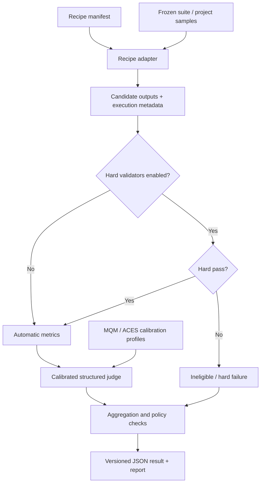

# Aventine：愿景、目的与核心工作流

## 一句话定义

Aventine 是一个面向开发者和研究人员的、可复现的 translation recipe/pipeline 评测工具。

它评测的不是一个孤立的模型名称，而是一整套可以复现的翻译配方：

```text
模型 + provider/runtime + prompt + decoding settings
+ context/glossary + post-processing + repair + optional validators
```

> Remis 不是在训练翻译模型，Aventine 也不是。
> 我们是在校准和运行一个用于翻译配方回归测试的评估工具。

## 为什么要做

翻译评测领域已经有很多高质量组件：WMT/MQM 人工评测数据、ACES challenge set、
`mt-metrics-eval`、COMET/xCOMET，以及各种 MQM 风格的 LLM-as-a-Judge 方法。

缺少的是一辆可以实际使用的“成品车”：

- 把完整翻译 pipeline 视为一级评测对象；
- 同时保留确定性规则、自动 metric 和 LLM judge 的边界；
- 校准 judge，而不是默认相信 judge；
- 能记录 translation、repair、failure propagation、延迟和复现信息；
- 能在本地模型和开发者 CI 中运行；
- 不要求把数 GB 的外部数据提交进仓库。

Aventine 最初来自 Remis 的真实需求。Remis 的本地化 benchmark 是第一个垂直场景和兼容
adapter，但 Aventine 的 core 不应永久绑定 Paradox 游戏格式。

## 目标用户

近期用户不是普通翻译软件用户，而是：

- 维护本地或私有翻译 pipeline 的开发者；
- 比较 prompt、模型、repair 和后处理策略的研究人员；
- 需要为领域术语、结构安全和回归测试建立 frozen suite 的工具作者；
- 希望在自己的硬件上运行 judge 或 xCOMET 的本地模型使用者。

因此，近期产品形态是 CLI、JSON/JSONL artifact、Markdown/JSON report 和 CI integration。
图形页面不在 V0 范围内。

## 核心原则

### 1. 评测 recipe，而不是只排模型

相同模型在不同 prompt、上下文、采样参数、repair 策略和 validator 配置下可能表现完全不同。
排行榜条目的主键必须最终指向一个可复现 recipe manifest，而不只是 `model_name`。

### 2. Hard validator 拥有 veto 权

如果启用了 hard validators，并且某个候选 `hard_pass=false`，该候选不能击败
`hard_pass=true` 的候选。LLM judge 无权覆盖这个决定。

当 validator 被禁用时，Aventine 可以评测普通翻译文本；这属于明确记录的 recipe policy，
不能在运行时悄悄关闭。

Hard validators 负责可确定的安全约束，例如：

- placeholder/protected token parity；
- 变量、标签、转义换行和 key/YAML 结构；
- 项目定义的 glossary hard violation；
- 其他可以用确定性程序判断的格式安全问题。

### 3. LLM judge 只负责软质量

Judge 主要评价：

- semantic accuracy；
- terminology；
- fluency/naturalness；
- style/register/locale；
- context and discourse consistency；
- repair track 中的 unnecessary changes / over-editing。

Judge 必须输出符合 schema 的 JSON。非 JSON、缺字段和无法解析的输出都是可统计失败。

### 4. Judge 必须先校准

外部标准的作用是校准评估工具，不是替代项目自己的 benchmark：

- MQM 小样本检查严重错误召回、false-good 和类别/严重程度判断；
- ACES/SPAN-ACES 检查 fluent-but-wrong、实体、数字、否定、遗漏和添加；
- Remis frozen benchmark 检查游戏本地化、结构安全、术语和 repair over-editing；
- xCOMET/MetricX 等只作为可选 baseline，不拥有最终真理。

LLM judge 的结果永远不能伪装成人类金标。

### 5. 复现信息属于结果的一部分

每次运行应记录：

- recipe manifest 及其 SHA-256；
- suite、sample revision 和 adapter revision；
- provider、model、模型 revision 和关键 decoding 参数；
- prompt revision；
- validator policy；
- judge profile 和 calibration revision；
- optional metric versions；
- latency、execution failure 和 parse failure；
- Python、OS、硬件等必要环境信息。

## 核心工作流



### 阶段 1：声明 recipe

Recipe manifest 是可复现入口。当前 schema 位于：

```text
src/remis_aventine/schemas/recipe-manifest.schema.json
```

V0 已经区分：

- provider 和 model；
- translate/repair/post-process stages；
- prompt revision；
- validator `veto` 或 `disabled` policy；
- reference access policy；
- 自由 metadata。

### 阶段 2：adapter 执行 pipeline

Adapter 把通用 manifest 映射到具体实现。第一个 adapter 将复用 Remis 当前模块和
`evaluate_translation_quality.py` 产生的 artifact。

过渡期允许 `remis_compat` 直接依赖 Remis checkout。长期依赖方向应逐渐反转：通用
schema、aggregation 和 calibration 进入 Aventine core，Remis 只保留产品特定执行与 validator。

当前阶段明确采用“复用优先”：Provider factory、生产 Prompt/Glossary 组装、
`PostProcessValidator`、`TranslationFixerAgent` 和 benchmark runner 继续以 Remis 实现为准。
Aventine 不复制这些模块的平行版本，而是在兼容层消费其 artifact；后续执行型 adapter 也应优先
通过受控 checkout/import seam 调用 Remis。只有被证明通用、合同稳定且不再依赖 Remis 产品状态的
部分，才逐步迁入 Aventine core。

### 阶段 3：确定性校验

Validators 在 judge 之前执行。结果至少包含 `enabled`、`passed` 和结构化 findings。

禁止出现以下逻辑：

```text
hard_pass=false + judge prefers candidate => candidate wins
```

唯一需要单独定义 winner policy 的情况是两边都 hard fail；此时默认应报告“两边均不合格”，
而不是制造一个看似合格的冠军。

### 阶段 4：自动 metric 与 calibrated judge

自动 metric 和 LLM judge 都是证据来源。它们可以被比较、校准和质疑。

Judge calibration profile 应记录：

- schema/prompt revision；
- calibration sample revision；
- major/critical false-negative 指标；
- JSON parse failure；
- category confusion；
- position bias / swap consistency；
- 与 hard validators 的 contradiction count。

### 阶段 5：聚合与报告

聚合层执行 winner eligibility、失败传播和指标汇总。报告应允许读者回答：

- 哪个 recipe 更可靠，而不只是平均分更高；
- 严重错误主要来自哪些 phenomenon；
- repair 是否修复问题，还是进行了不必要改写；
- judge 自己在哪些类别上不可信；
- 结果能否在相同 recipe 和 sample revision 下复现。

## 初始 suite

### `mqm`

用少量人工 MQM 样本校准严重错误检测，优先降低 false-good。

核心指标包括 `major_error_recall`、`critical_error_recall`、`false_good_rate`、
`severity_agreement_loose`、`category_confusion_counts` 和 `json_parse_failure_count`。

### `aces`

使用 contrastive good/bad translation 测试流畅但错误的译文。

核心指标包括 `bad_candidate_detection_accuracy`、`major_false_negative_rate`、
`phenomenon_accuracy_by_type`、`low_confidence_rate` 和 source evidence coverage。

### `remis`

使用 Remis frozen benchmark 的真实模型输出测试 translation/repair recipe。

核心指标包括 hard-validator contradiction、critical/terminology/style 错误、repair over-editing、
pairwise winner 和 judge confidence distribution。

## 仓库与数据边界

仓库提交：

- schema；
- prompt/profile revision；
- 小型、许可证明确的 example fixture；
- adapter 和 summary code；
- tests、docs 和 CI。

仓库不提交：

```text
benchmark_data/
benchmark_results/
.cache/aventine/
外部 WMT/ACES 原始大数据
模型权重
真实 provider key
```

外部数据必须保留来源、许可证和 citation metadata。不同数据集的许可证不能被 Aventine 的
AGPL 许可证覆盖或替代。

## 当前代码结构

```text
src/remis_aventine/
  cli.py                 # CLI entry point
  doctor.py              # read-only environment probe
  validation.py          # JSON Schema validation
  calibration.py         # deterministic calibration summaries
  adapters/remis.py      # Remis artifact compatibility adapter
  schemas/               # versioned public contracts
examples/calibration/    # synthetic MQM/ACES fixtures
examples/recipes/        # small, safe manifests
tests/                   # model-free unit tests
docs/zh/developer/       # Chinese developer documentation
```

## 实施阶段

1. **V0**：CLI、recipe/run/judge schema、fake fixtures、summary metrics、Remis result adapter，
   不下载大数据。首批零件已经落地；尚缺 Aventine-native runner/aggregator。
2. **V1**：整理 20–50 条 MQM/ACES 小样本，运行 calibrated judge。首轮 48 条多语言样本及
   DeepSeek、Grok、Gemma 三方远程对照已经完成。
3. **V2**：接入 `mt-metrics-eval` / WMT MQM adapter。首个 bounded adapter 已落地；真实 WMT
   数据仍由使用者在仓外安装和下载。
4. **V3**：接入 ACES/SPAN-ACES adapter。首个 bounded pairwise adapter 已落地，支持固定
   source hash、language-pair/phenomenon coverage、A/B swap 与独立 span gold。
5. **V4**：接入 Remis recipe pairwise report 和 repair over-editing。
6. **V5**：可选 xCOMET/xCOMET-lite baseline。

## 明确不做

- 不实现完整 WMT leaderboard；
- 不把外部大数据或模型权重提交进 Git；
- 不把 judge 接入自动批准或生产写入路径；
- 不让 judge 自动修改 prompt、glossary 或 model defaults；
- 不做 learned router 或 self-improving harness；
- 不让 judge 重复评价 deterministic validator 已经可以确定的问题；
- 不把一堆模型分数包装成学术结论，却不报告 judge 自身的校准失败。

先把这辆车开起来，能刹车、能复现、仪表盘不撒谎。之后它要不要变成论文，是后面的事。
